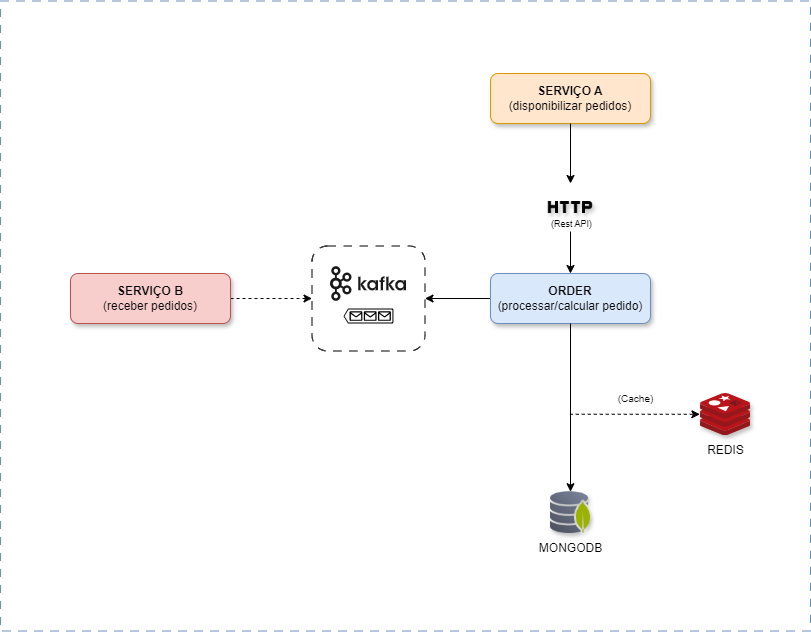

# 📦 Order Service Project

Este projeto é um serviço de pedidos escalável e eficiente, projetado para processar um grande volume de requisições com alto desempenho. Ele utiliza **Spring Boot**, **Redis**, **MongoDB**, e **Docker**, garantindo **baixa latência, resiliência e escalabilidade**.

---

## Tecnologias Utilizadas

- **Spring Boot** - Framework principal para desenvolvimento.
- **Redis** - Utilizado como cache para otimizar a recuperação de dados e reduzir carga no banco.
- **MongoDB** - Banco NoSQL escolhido por sua flexibilidade e escalabilidade.
- **Spring Data** - Facilita a comunicação com o banco.
- **Docker & Docker Compose** - Para facilitar a orquestração do ambiente.
- **JMeter** - Usado para testes de carga.

---

## Arquitetura

O sistema segue uma **arquitetura híbrida baseada em microsserviços**, utilizando um banco uma conexão com o sistema A por meio de HTTP REST
e no sistema B, Kafka. NoSQL para armazenar pedidos e um cache Redis para otimizar acessos frequentes.


---

## Configuração do Ambiente

### 🐳 Rodando com Docker Compose

1. **Clone o repositório**
   ```sh
   git clone https://github.com/seu-usuario/order-service.git
   cd order-service
   ```

2. **Suba os containers**
   ```sh
   docker-compose up --build
   ```

3. A API estará disponível em `http://localhost:8080`.
---

## Endpoints Principais

## Criar um Pedido (POST /orders)

Este endpoint permite a criação de um novo pedido. Para garantir a idempotência (evitar duplicação acidental), um cabeçalho `Idempotency-Key` deve ser enviado em cada requisição.

### **📌 Requisição**
**URL:**  
`POST /orders`

**Headers:**
```http
Content-Type: application/json
Idempotency-Key: a1b2c3d4-e5f6-7890-ab12-cd34ef56gh78
````

#### Request Body
```json
{
  "externalId": "ORDER-12345",
  "items": [
    {
      "productId": 1,
      "productName": "Vinho Branco",
      "quantity": 4,
      "price": 25.00
    }
  ],
  "createdAt": "2025-02-19T15:00:00"
}
```

### Buscar Pedido por ID
```http
GET /api/orders/{externalId}
```

---
## 🛠 Testando com JMeter (Adicionando Idempotency-Key Dinâmico)

Para testar a criação de pedidos no **JMeter**, precisamos adicionar um **header dinâmico** para a chave de idempotência. Isso evita que requisições consecutivas sejam rejeitadas por reutilização da mesma chave.

### **📌 Configuração no JMeter**
1. **Criar um Test Plan**
   - Abra o **Apache JMeter** e crie um novo **Test Plan**.


2. **Adicionar um Thread Group**
   - Clique com o botão direito no **Test Plan** → `Add` → `Threads (Users)` → `Thread Group`.


3. **Criar um HTTP Request**
   - Dentro do **Thread Group**, clique com o botão direito → `Add` → `Sampler` → `HTTP Request`.
   - Configure a requisição para:
      - **Method:** `POST`
      - **Server Name or IP:** `localhost`
      - **Port Number:** `8080` (ou a porta da sua aplicação)
      - **Path:** `/orders`
      - **Body Data:**
        ```json
        {
            "externalId": "ORDER-${__Random(10000,99999)}",
            "items": [
                {
                    "productId": 1,
                    "productName": "Vinho Branco",
                    "quantity": 4,
                    "price": 25.00
                },
                {
                    "productId": 2,
                    "productName": "Rum Prata",
                    "quantity": 3,
                    "price": 35.00
                }
            ],
            "createdAt": "2025-02-19T15:00:00"
        }
        ```
      - Aqui usamos **`${__Random(10000,99999)}`** para gerar um **externalId** dinâmico.


4. **Adicionar o Header Idempotency-Key**
   - Dentro do **HTTP Request**, clique com o botão direito → `Add` → `Config Element` → `HTTP Header Manager`.
   - Adicione um novo header:
      - **Name:** `Idempotency-Key`
      - **Value:** `${__UUID}`

   - **Explicação**: `${__UUID}` gera um **UUID único** a cada requisição, garantindo que o **Idempotency-Key** não seja reutilizado.
 

5. **Adicionar um PreProcessor para Gerar a Idempotency-Key**
   - Dentro do **HTTP Request**, clique com o botão direito → `Add` → `Pre Processors` → `JSR223 PreProcessor`.
   - No campo **"Script"**, insira o seguinte código:
      ```groovy
     vars.put("IDEMPOTENCY_KEY", java.util.UUID.randomUUID().toString());

5. **Adicionar um Listener para Visualizar Respostas**
   - Clique com o botão direito no **Thread Group** → `Add` → `Listener` → `View Results Tree`.


6. **Executar o Teste**
   - Clique no **Play (▶️)** no topo do JMeter para rodar o teste.

### **🛠 Exemplo de Header Dinâmico no JMeter**
| Header Key       | Header Value          |
|-----------------|----------------------|
| `Content-Type`  | `application/json`   |
| `Idempotency-Key` | `${__UUID}`          |

### **🎯 Benefícios**
✅ Garante que cada requisição de criação de pedido tenha um **Idempotency-Key único**.  
✅ Evita erros **409 Conflict** causados por reutilização da chave.  
✅ Simula cenários reais de alta concorrência sem colisões de chave.


---

## 🎯 Próximos Passos (Fator tempo)

- Implementar **mensageria com Kafka** para eventos assíncronos.
- Adicionar **rate limiting** para evitar sobrecarga.
- Melhorar logs e métricas para análise em tempo real.
- Adicionar Observabilidade com OpenTelemetry

---